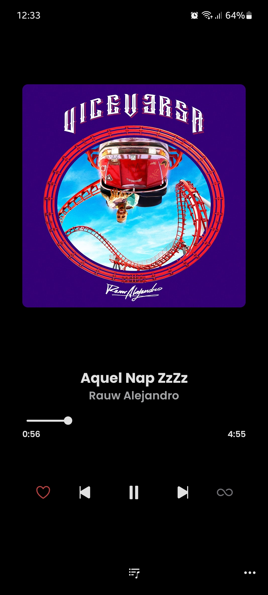
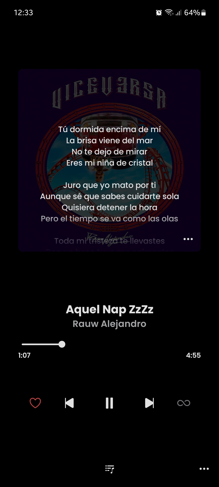
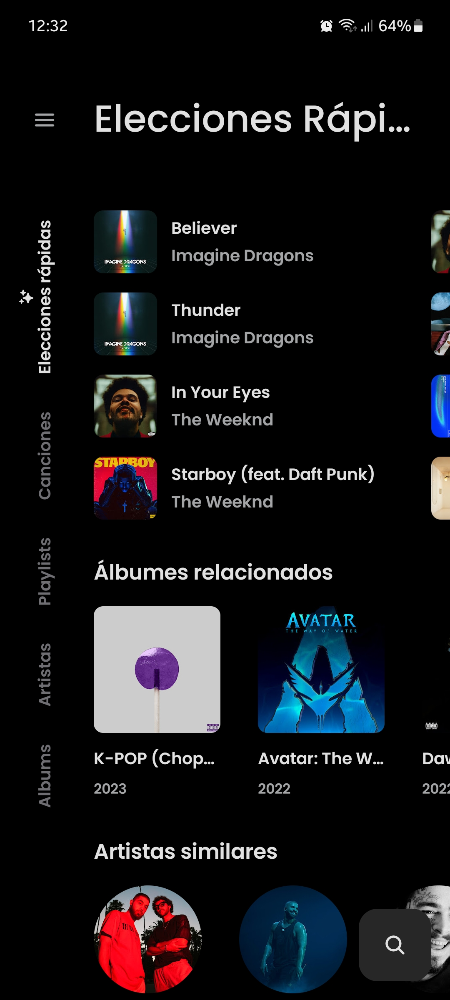
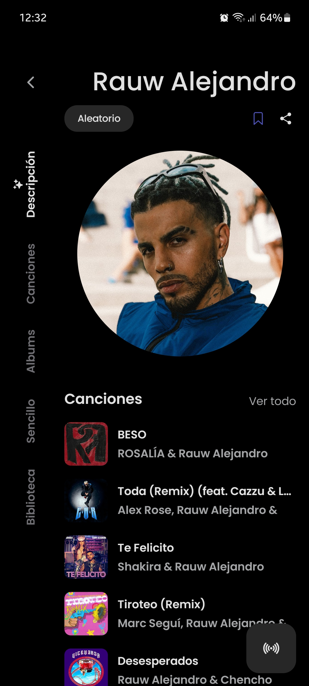
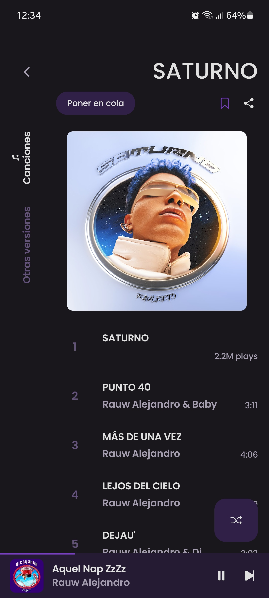
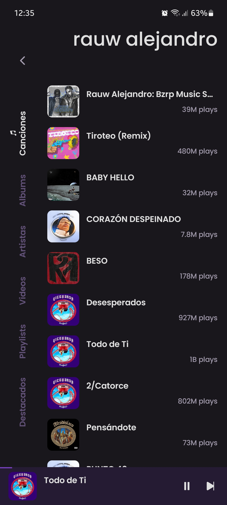

    
    <h1>ViMusic</h1>
    
Una aplicación de Android para transmitir música desde YouTube Music

    
An Android application for streaming music from YouTube Music

    

---

  
  
  

  
  
  

## Características
- Reproduce (casi) cualquier canción o video de YouTube Music
- Reproducción de fondo
- Caché de fragmentos de audio para reproducción sin conexión
- Busque canciones, álbumes, videos de artistas y listas de reproducción
- Marcar artistas y álbumes.
- Importar listas de reproducción
- Obtener, mostrar y editar letras de canciones o letras sincronizadas
- Gestión de listas de reproducción locales
- Reordenar canciones en lista de reproducción o cola
- Tema claro/oscuro/dinámico
- Saltar silencio
- Tiempo de dormir
- Normalización de audio
-Android automático
- Cola persistente
- Abrir enlaces de YouTube/YouTube Music (`ver`, `lista de reproducción`, `canal`)
- ...

## Features
- Play (almost) any song or video from YouTube Music
- Background playback
- Cache audio chunks for offline playback
- Search for songs, albums, artists videos and playlists
- Bookmark artists and albums
- Import playlists
- Fetch, display and edit songs lyrics or synchronized lyrics
- Local playlist management
- Reorder songs in playlist or queue
- Light/Dark/Dynamic theme
- Skip silence
- Sleep timer
- Audio normalization
- Android Auto
- Persistent queue
- Open YouTube/YouTube Music links (`watch`, `playlist`, `channel`)
- ...

## Instalación

## Acknowledgments-Expresiones de gratitud
- [**YouTube-Internal-Clients**](https://github.com/zerodytrash/YouTube-Internal-Clients): A python script that discovers hidden YouTube API clients. Just a research project.
- [**ionicons**](https://github.com/ionic-team/ionicons): Premium hand-crafted icons built by Ionic, for Ionic apps and web apps everywhere.

<a href="https://www.flaticon.com/authors/ilham-fitrotul-hayat" title="music icons">App icon based on icon created by Ilham Fitrotul Hayat - Flaticon</a> 
<a href="https://github.com/vfsfitvnm/ViMusic" title="ViMusic">App based on ViMusic created by vfsfitvnm - Github</a>

## Descargo de responsabilidad
Este proyecto y su contenido no están afiliados, financiados, autorizados, respaldados o asociados de ninguna manera con YouTube, Google LLC o cualquiera de sus afiliados y subsidiarias.

Cualquier marca comercial, marca de servicio, nombre comercial u otros derechos de propiedad intelectual utilizados en este proyecto pertenecen a sus respectivos propietarios.

## Disclaimer
This project and its contents are not affiliated with, funded, authorized, endorsed by, or in any way associated with YouTube, Google LLC or any of its affiliates and subsidiaries.

Any trademark, service mark, trade name, or other intellectual property rights used in this project are owned by the respective owners.
